# How to deploy web services on AWS?

## Prerequisites

* [AWS](https://aws.amazon.com/) account(12 months free access for new user).

* [Github](https://github.com/) or [Bitbucket](https://bitbucket.org/product) account.

* Basic knowledge of Git.

* Basic knowledge of Linux/Unix. 

## 1. Launch a Virtual Machine in AWS

* From AWS console click on **Launch a virtual machine**.

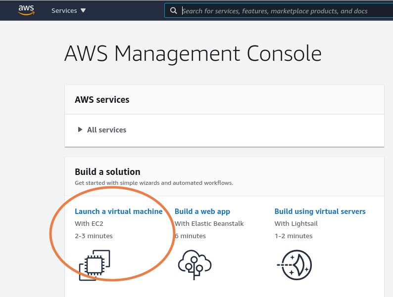

* Select **ubuntu server** from the list. 

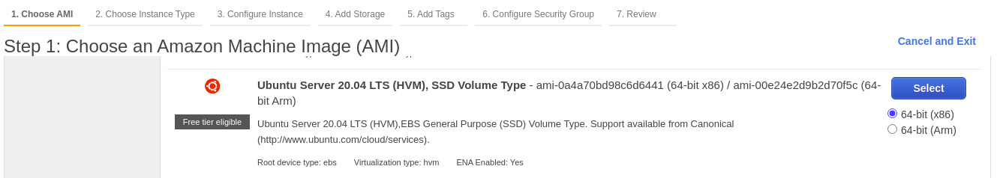

* Select the instance type eligible for free tier if available otherwise select the one that suits your requirement.

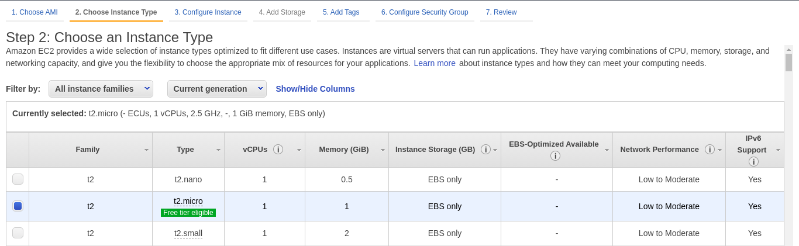

* In **Configure Instance Details** tab keep the default configurations and click on next. **Make sure Auto-assign Public IP is set to Enable**.

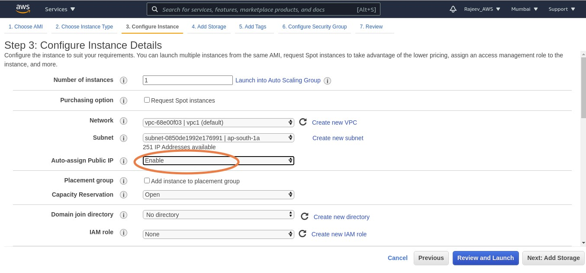

* In **Add storage** tab keep the default configuration unless you need more storage.

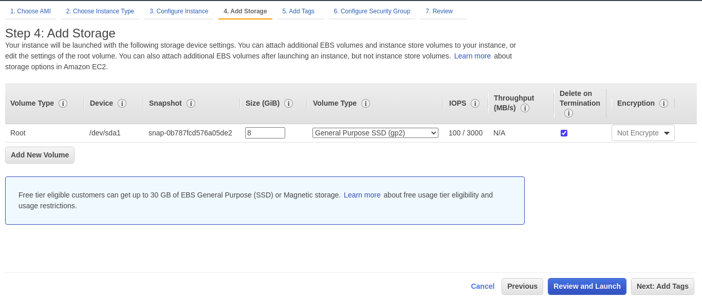

* Skip the **Add tags** tab.

* In **Configure Security Group** by default the **SSH** source IP is set to **0.0.0.0/0** which means any system can access this instance if they have the valiid private key. For better security change **SSH** source IP to IP address of the system from where you would like to access the server instance. You can add multiple IP addresses here in case you want to access it from multiple devices.

> In case your system's IP address changes make sure to update this value in **AWS ** con 

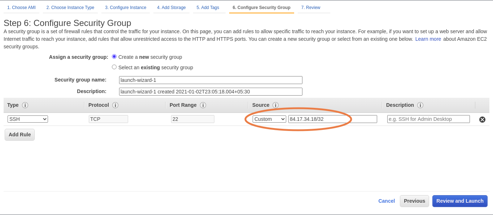

* Click on Review and Launch. Review the changes and click on Launch.

* You'll be prompted to create or select key pair. If it is your first time creating an instance select **create a new key pair** from drop down. Enter your preferred key pair name then click on **Download Key Pair**. Copy and Paste the downloaded file in secure location this file will be used to login to **AWS** instance.

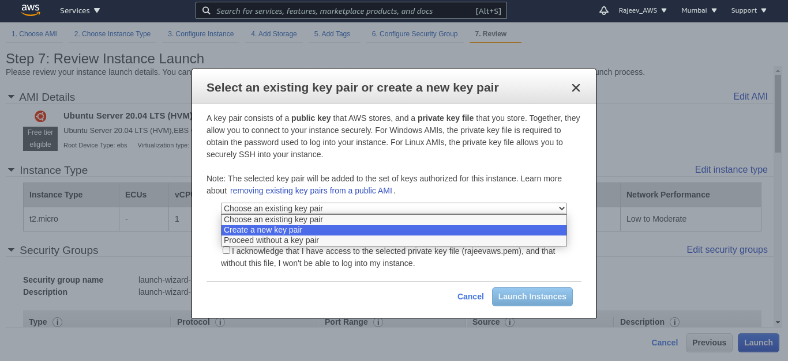 

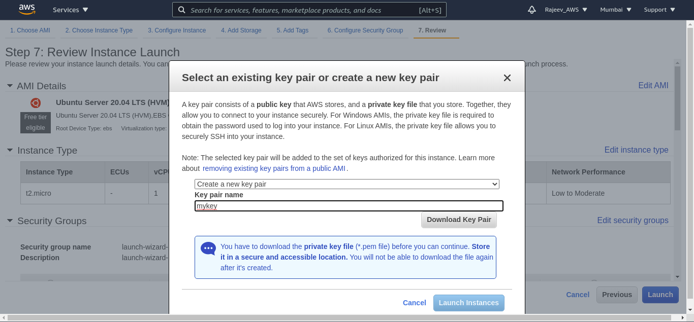

* Now accept/acknowledge the terms and condition and click on **Launch Instance**. Now go back to **AWS Management console** and select **EC2**. You'll be redirected to **EC2 Dashboard** where you can find informations about number or instances running and other informations. Click on **instances(running)**.

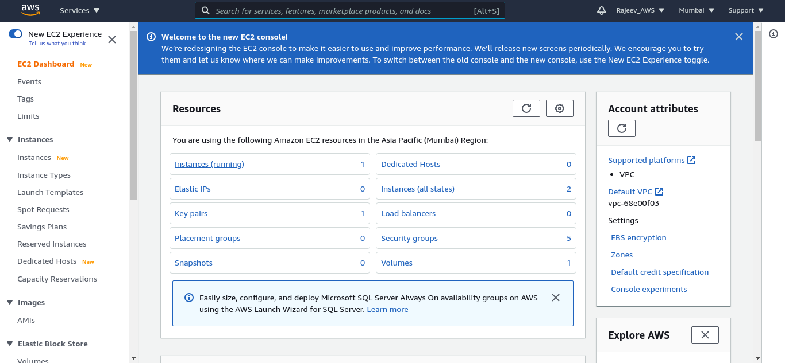

* On next screen if you see **Instance State** as **Running** and **Status Check** as **2/2 checks passed** congratulations your instance is up and running successfully.

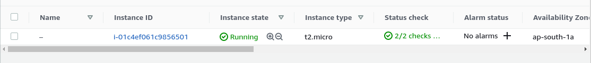

## 2. How to access your Instance?

### From Linux/Unix system

* Install **ssh** on your system.

* Open Terminal and navigate to directory where you pasted your **key-pair** file.

* Go back to **EC2 instance dashboard**. Click on **Instance ID** > **Connect** then follow the instructions as given.

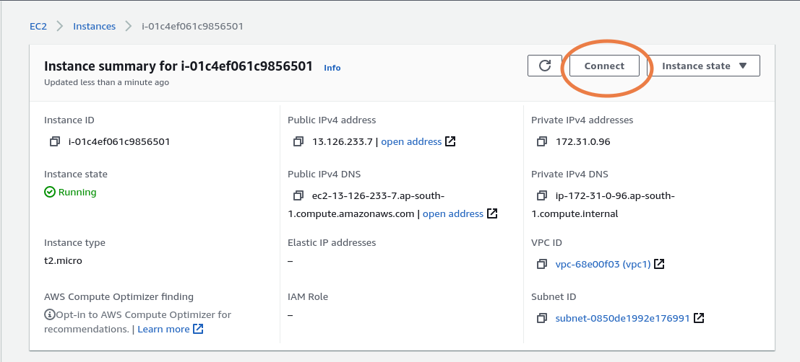

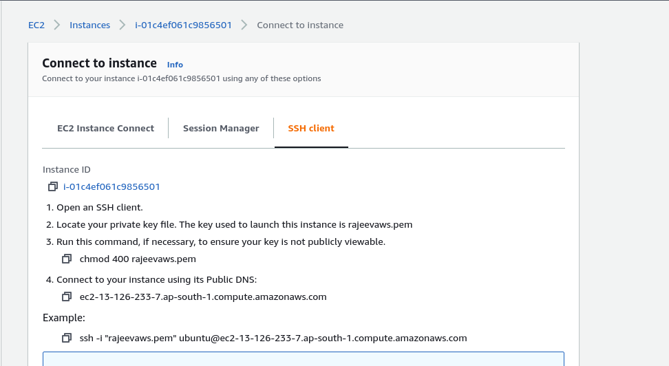

* You can replace the **Public DNS** with your instances **Public IPv4** address. Then the command will look something like `ssh -i rajeevaws.pem ubuntu@13.126.233.7` You can find your Public IPv4 address in **Instance Dashboard.** 

* On successful authentication your **Terminal** should output something like this

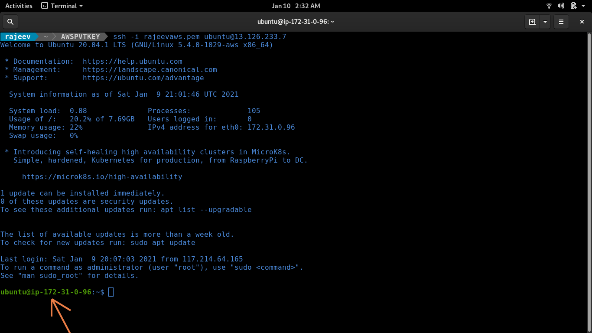

* Now you are inside your **AWS** instance.

## 3. How to deploy microservice on AWS?

* In your **ssh** shell execute following command.

> sudo apt update && sudo apt upgrade -y

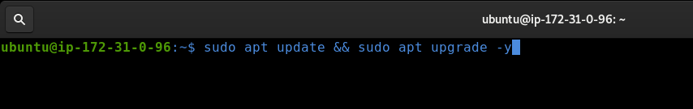

* Install **Java**

> sudo apt install default-jre

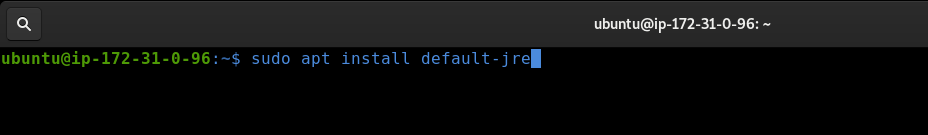

> sudo apt install default-jdk

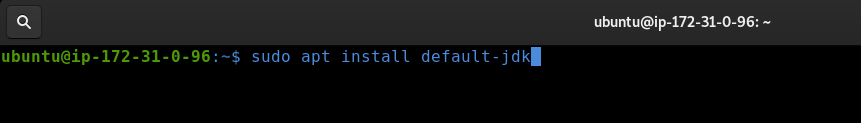

* Install **Maven**

> sudo apt install maven

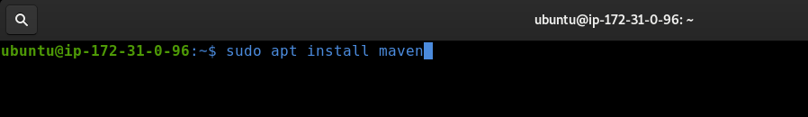

* Clone the repository where you are maintaining your microservice code.

> git clone https://github.com/rajeev29five/Microservice-Architecture-Practical-Implementation.git

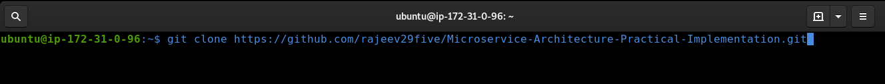

* Navigate inside your repo to the project that you want to deploy. As of now we'll deploy the [**helloworld**](https://github.com/rajeev29five/Microservice-Architecture-Practical-Implementation/tree/main/helloworld) microservice that we created in first tutorial.

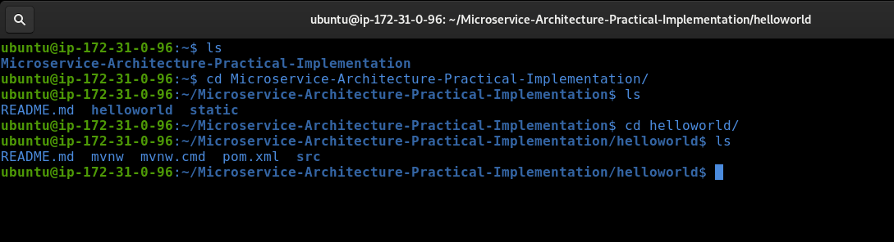

* Build the project by executing the following command.

> mvn clean install

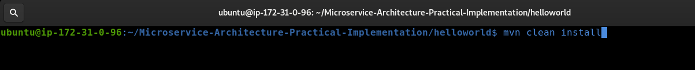

If you get a **BUILD SUCCESS** message, your project have been built successfully.

* Navigate to **target** dir inside your project. You'll find jar file with name **helloworld-0.0.1-SNAPSHOT.jar**. We'll be deploying this jar file and our microservice will be up and running. Execute the below command

> java -jar helloworld-0.0.1-SNAPSHOT.jar

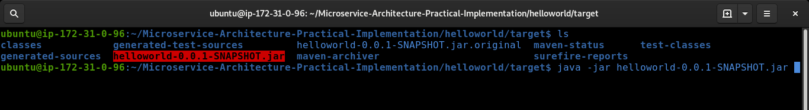

* On successful deployment you should see message like **Tomcat started on port(s) : 8080**. Congratulations your microservice is now deployed on **AWS** and can be accessed from anywhere around the globe. But before that we need to configure some security rules(the reason why we weren't able to access our microservice over the internet when deployed on localhost) in order for our microservice to be available on public internet.

* From **Instance Dashboard** navigate to **Security** then click on **Security Group**.

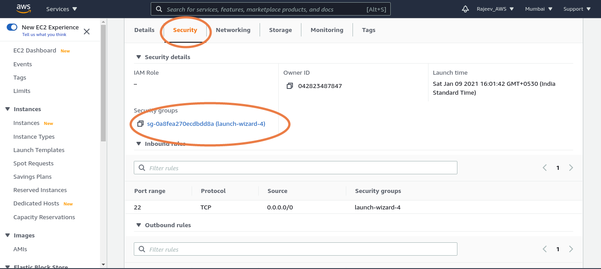

* Click on **Edit Inbound Rule** then add and save the rules as follows : 

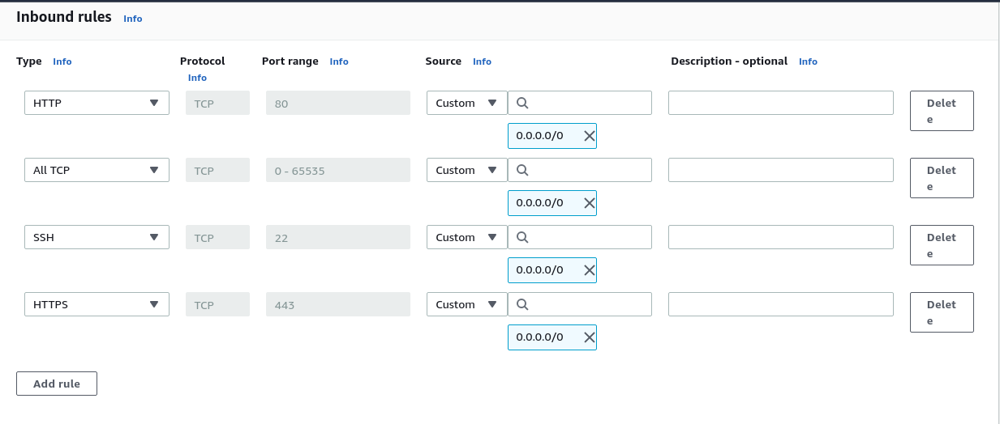

* Open your browser and just like in first tutorial we had used `localhost:8080/greeting` we are going to use same endpoint except we will replace `localhost` with our **AWS instance**'s public IP something like this `13.126.233.7:8080/greeting`. For you the IP may be different so use your **AWS's IP** address. Same goes for with **name** parameter `http://13.126.233.7:8080/greeting?name=Rajeev`.

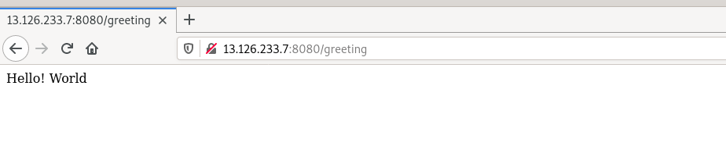

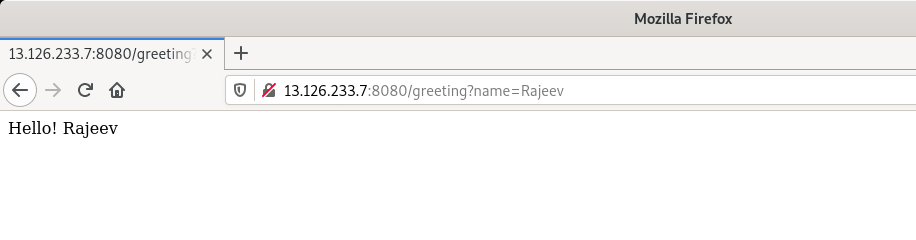

* Just like in last tutorial you can also access it via your mobile browser or any other device capable of making HTTP request.

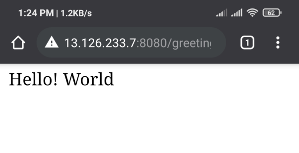 

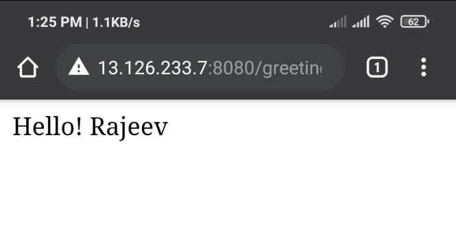

## 3. Few thing to keep in mind.

* Your microservice is running as process in your **AWS instance** and if you used this command `java -jar helloworld-0.0.1-SNAPSHOT.jar` as soon as you exit your **ssh** session it will kill the process and your microservice will stop working. To keep your microservice running as background process use the following command.

> nohup java -jar helloworld-0.0.1-SNAPSHOT.jar 2>&1 >> helloworld.log &

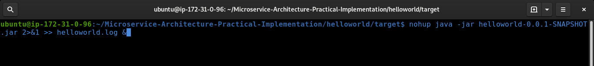

* In case you make any changes to your microservice code you'll have to rebuild the project and redeploy it to **AWS instance** for changes to reflect.

* If you get an error port 8080 is already is being used, that is because your older microservice is still running in the background. You'll have to kill the older microservice process, execute to following command to kill the process.

* First find the process ID(PID) of the process that is using port 8080 by executing the following command 

> lsof -i :8080

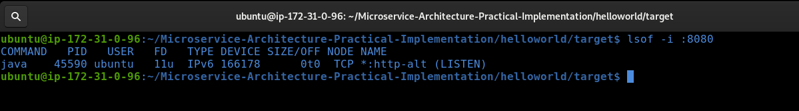

* Kill the process by executing the following commad.

> kill -9 45590

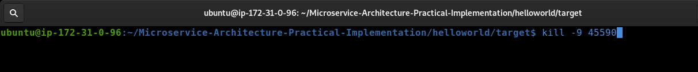

* Redeploy the microservice.

> nohup java -jar helloworld-0.0.1-SNAPSHOT.jar 2>&1 >> helloworld.log &