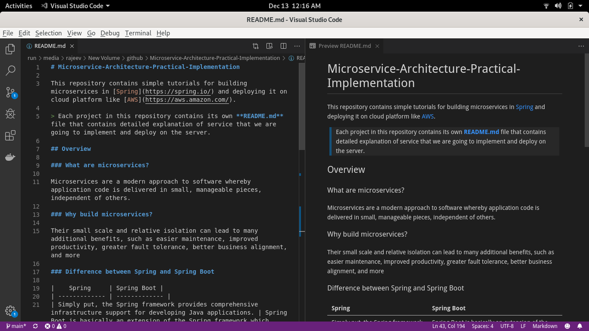

# Microservice-Architecture-Practical-Implementation

This repository contains simple tutorials for building microservices in [Spring](https://spring.io/) and deploying it on cloud platform like [AWS](https://aws.amazon.com/).

> Each project in this repository contains its own **README.md** file that contains detailed explanation of service that we are going to implement and deploy on the server. 

## Overview

### What are microservices?

Microservices are a modern approach to software whereby application code is delivered in small, manageable pieces, independent of others.

### Why build microservices?

Their small scale and relative isolation can lead to many additional benefits, such as easier maintenance, improved productivity, greater fault tolerance, better business alignment, and more

### Difference between Spring and Spring Boot

|    Spring     | Spring Boot |
| ------------- | ------------- |
| Simply put, the Spring framework provides comprehensive infrastructure support for developing Java applications. | Spring Boot is basically an extension of the Spring framework which eliminated the boilerplate configurations required for setting up a Spring application.  |

For more information on [Spring vs Spring Boot](https://www.baeldung.com/spring-vs-spring-boot)

## Prerequisites

* A favorite text editor or IDE ([STS](https://spring.io/tools) preferred 'cause it's free)

* JDK 1.8 or later (Download from [here](https://www.oracle.com/java/technologies/javase-downloads.html))
 
* Maven 3.2+ (Download from [here](https://maven.apache.org/download.cgi))

* AWS account or other cloud platform account.

* Familiarity with Unix/Linux commandline for server deployment.

## How to effectively use this repository?

> clone this repository

> import the project that you want explore in **STS**

> open README.md file for that project in IDE or Text Editor that supports **Markdown** to view the file with proper formatting. Personally I find [VSCode](https://code.visualstudio.com/download) really easy to edit/view **Markdowns**. You can also preview the changes in realtime. Refer below image to see the difference between **Raw and Formatted Markdown.**

> If you do not want to access the **README.md** file through IDE or Text Editors you can always view it on github.com

