# First RESTful Web Service in SpringBoot

Assuming by now you have setup your development environment as mentioned [here](https://github.com/rajeev29five/Microservice-Architecture-Practical-Implementation#prerequisites), if yes let's get started with our first web service.

I won't be explaining any code implementation details in this tutorial rather we will go through the recurring steps that we'll have to go through for creating and deploying our Spring Boot services now and in future.

## Step 1 : Create Spring Boot project

* Go to [spring initializr](https://start.spring.io/) website. Dashboard will look something like this.

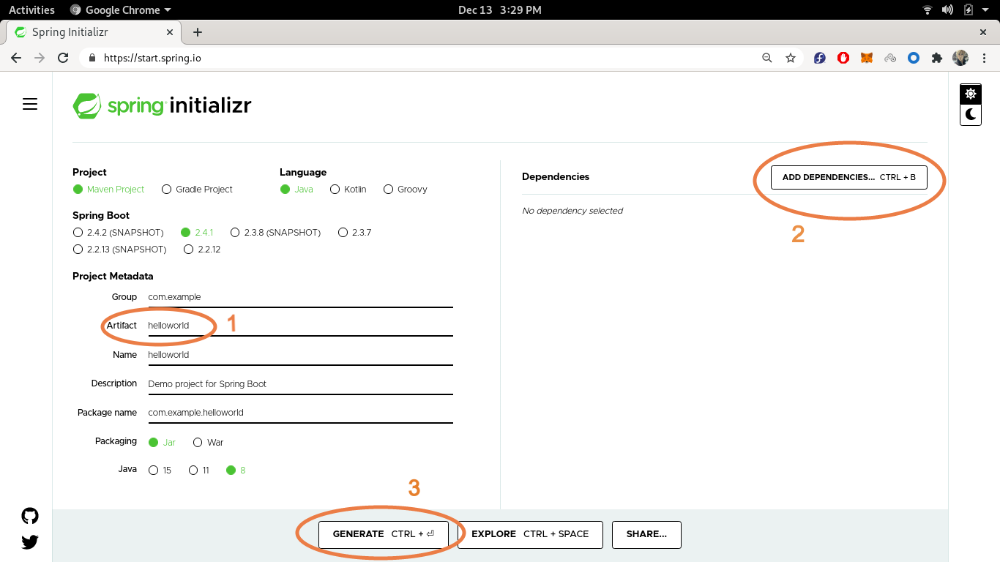

* Leave all the radio buttons with default selections, except **Java** version. Select your preferred **Java** version.

* Give **Artifact(1 in above image)** any preferred name you want.

* Click on **Add Dependencies(2 in above image)**, in prompt type **Spring Web** and select the first option. This will add dependecy required for creating RESTful service with Apache Tomcat as default embedded container in our Spring Boot project. 

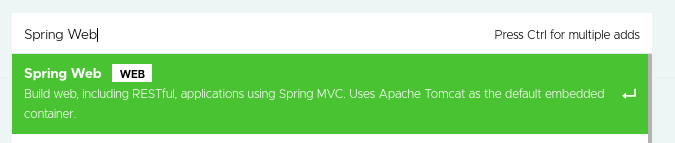

* Spring Initializr dashboard should look something like this by now.

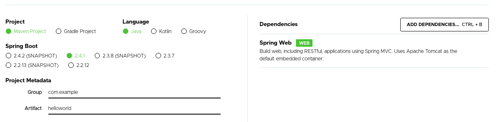

* Now click on **Generate(3 in above image)**. This will create and download the **Spring Boot** project.

* Extract the downloaded zip file to your preferred location.

## Step 2 : Import Spring Boot project in STS

* Open **STS** IDE.

* Go to **File > Import**. 

* Scroll down to **Maven** in prompt. Select **Existing Maven Projects** then click **Next**.

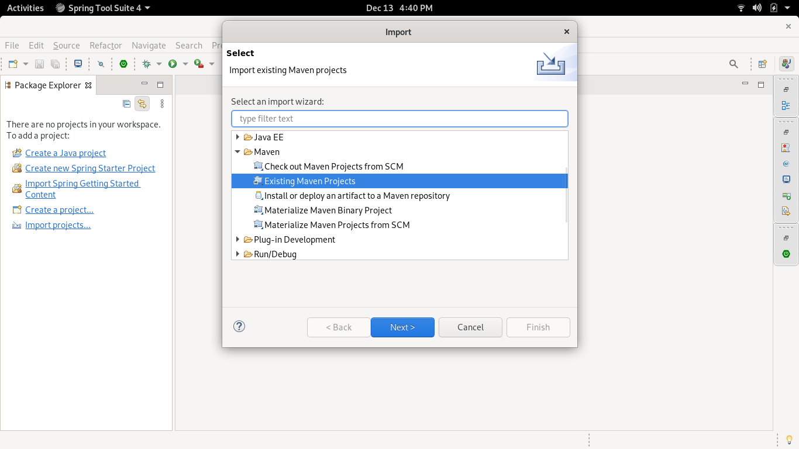

* Browse and naviagate to the location where you have extracted your **Spring Boot** project from Step 1. Then click **Finish**.

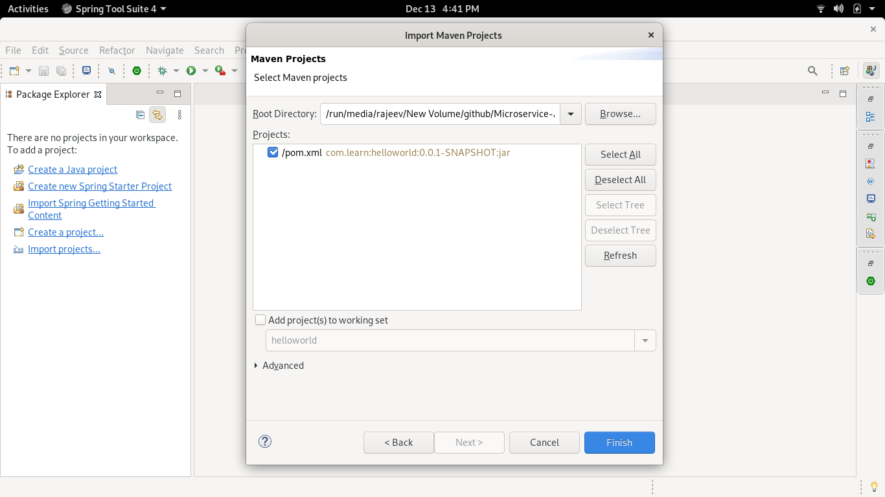

* **STS** will automatically download all the dependencies required for the projecct. Once all the dependecies have been downloaded your project structure will look something like this.

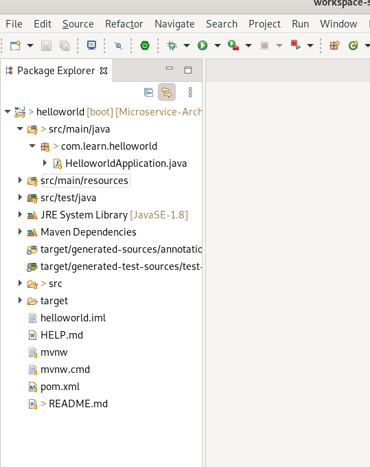

## Step 3 : Running your First Web Service

* From **Package Explorer** Right Click on **HelloworldApplication.java > Run as > Spring Boot App**.

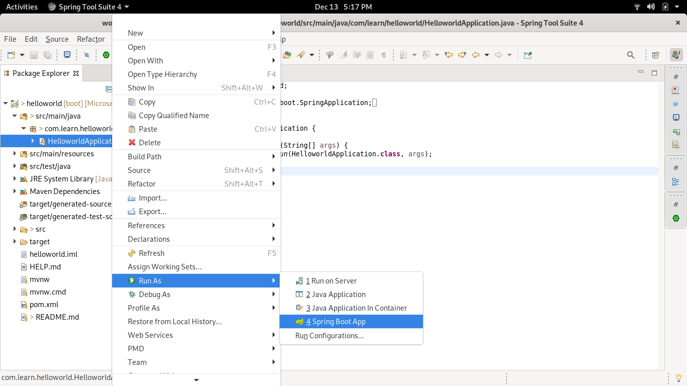

* This will launch your **Spring Boot** project as **Java Web Application** and if everything went right your console logs should look something like this.

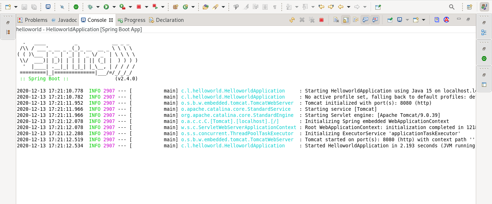

* By default the application runs on port 8080 and we will leave it as it is for now.

## Step 4 : Implementing our First REST endpoint.

* From **Package Explorer** select project then right click **New > Class** 

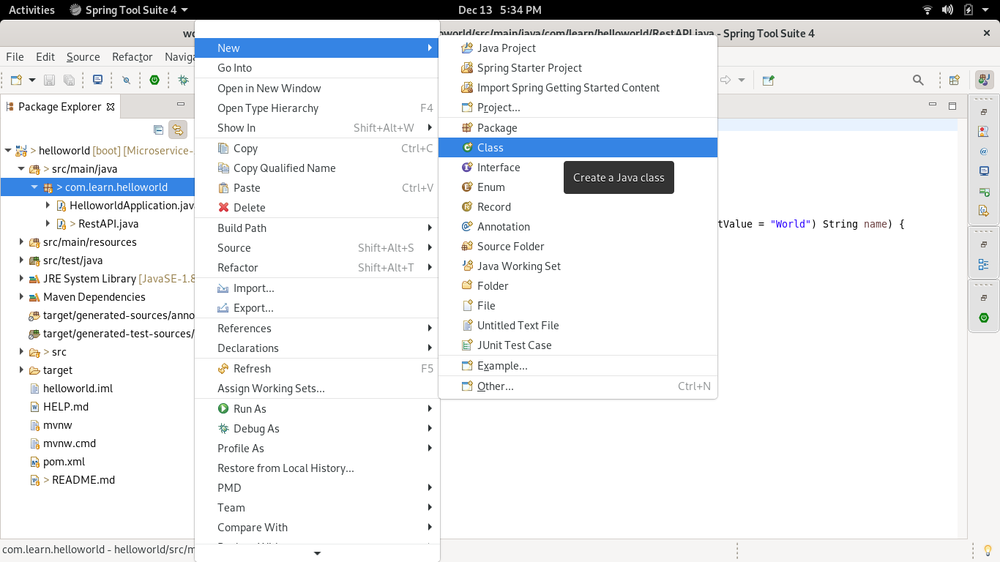

* Give your class any desired name, for me it is **RestAPI** then click **Finish**. This will create a new **Java** file in your project.

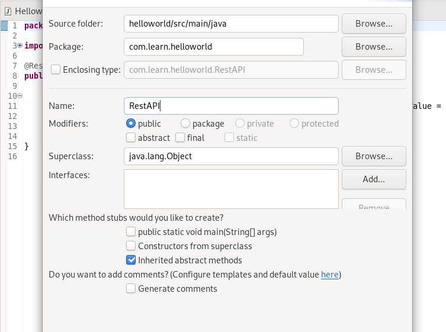

* Add this code in your newly created file. Please modify the code and change the class name accordingly. Will explain the code in coming tutorials.

```
@RestController
public class RestAPI {

    @GetMapping(path = "/greeting")
    public String helloWorld(@RequestParam(name="name", required = false, defaultValue = "World") String name) {
        return "Hello! " + name;
    }

}
```

* That's it! you just implemented your own REST endpoint. Stop and Re run the project as in **Step 3**. Choose the relevant button from the tool bar as required. The first button will run your project if it not running initially, third button is used to stop your application and last button is used to stop and restart your application.

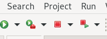

## Step 5 : Accessing your First REST endpoint.

* If your service restarted without any error in **Step 4**, then the easiest possible way to access your endpoint is through any modern web browser (true for GET requests, POST and other requests cannot be directly accessed through browsers' URL bar). So open your web browser and type `http://localhost:8080/greeting` in the URL bar and hit enter. This will display **Hello! World** message in the browser.

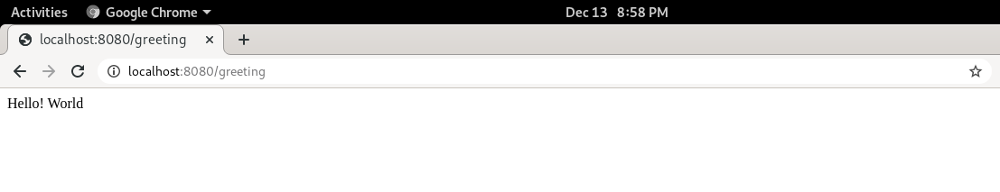

* Not just this you can pass an additional parameter with the endpoint as **name** with some desired value. For example if I modify my endpoint as `http://localhost:8080/greeting?name=Rajeev` the message will change to **Hello! Rajeev**.

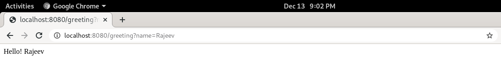

* Wait! Didn't I mention that we are going to build a RESTful service? And according to the definition of RESTful service we should be able to access this service from any device/client capable of making HTTP requests without any additional configuration. That's what we are going to do next.

* We'll be accessing this endpoint through our smartphone browser. Connect your laptop/PC to the same network as your smartphone i.e either connect your laptop/PC to your smartphone's WI-FI hotspot or vice versa or if your laptop/PC is connected to some WI-FI router connect your smartphone to same WI-FI. PS: Internet is not required.

* In this case you cannot use `http://localhost:8080/greeting` in your phone's browser because **localhost** is a hostname that refers to the current system(computer/device/smartphone) you'll have to use the **IP** of the system on which your Spring Boot project is running. In our case service is running in our laptop/PC. If you are on Linux/Unix system type **ifconfig** in **terminal** and hit enter. Look for **wlp6s0** the **IP** should look something like **192.168.1.4**, for windows use **ipconfig** command in **cmd**.

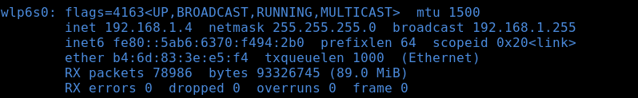

* Now we have the **IP** of the system on which our service is running. Open your phone's browser and type `http://192.168.1.4:8080/greeting` in URL bar and hit enter. You should see the same message as what was displayed on your laptop/PC's browser i.e **Hello! World**. Similarly use the endpoint with **name** parameter as `http://192.168.1.4:8080/greeting?name=Rajeev` to see the message **Hello! Rajeev**. You can also access endpoints from your laptop/PC's browser simultaneously. For verifying that both the browsers are accessing the endpoint independently use different values in **name** parameter. For example in laptop browser use `http://localhost:8080/greeting?name=Rajeev` and in mobile browser use `http://localhost:8080/greeting?name=John`. 

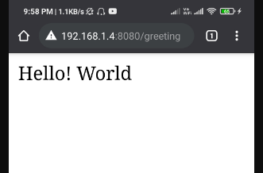 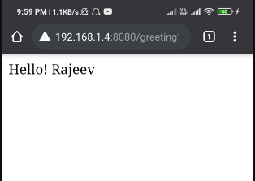

* Last thing left in this tutorial, if you disconnet your smartphone from this common network and try to access this service using mobile data over the internet you won't be able to access this service because it is protected by your system's firewall rules and is available only over common private network. Yes we can access this service over internet if we change our firewall rules but let's not do that because it will make your system vulnerable to attacks rather we'll use cloud platform like **AWS** in our case to deploy our service on cloud and make it accessible over the internet.


### Next Tutorial : How to deploy web services on AWS? 